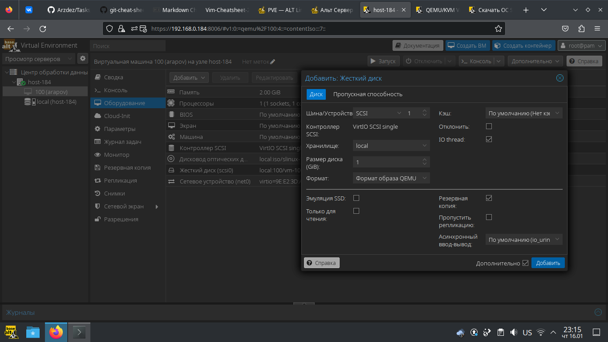
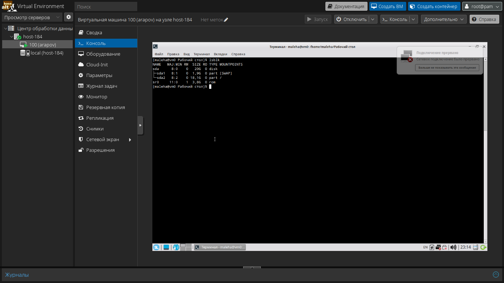
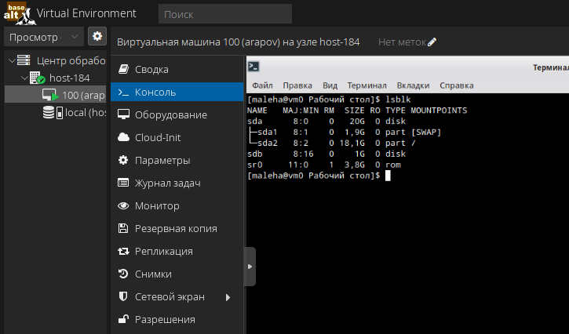
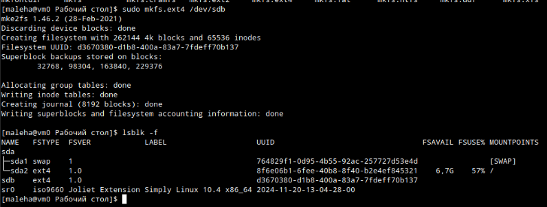
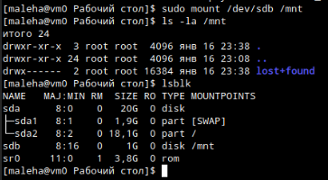
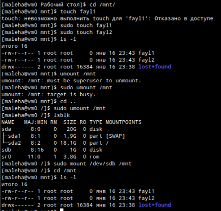
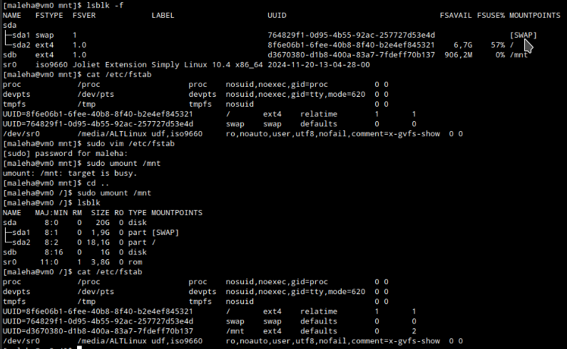
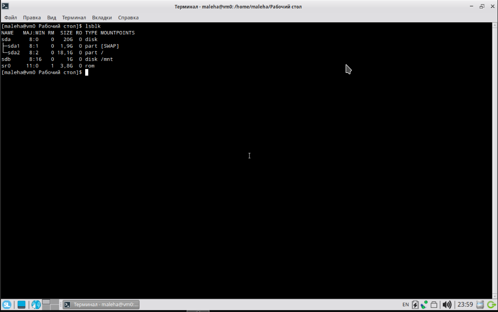

# Продолжаем

## 1 Выведите содержимое fstab. Что хранится в fstab?
*(еще вашей ВМ)*
```bash
cat /etc/fstab
proc            /proc                   proc    nosuid,noexec,gid=proc          0 0
devpts          /dev/pts                devpts  nosuid,noexec,gid=tty,mode=620  0 0
#tmpfs          /tmp                    tmpfs   nosuid                          0 0
UUID=6dcd4ec8-bcb3-4ee2-98bc-ae8a36b5612f       /       ext4    relatime        1       1
UUID=A7B0-10EA  /boot/efi       vfat    umask=0,quiet,showexec,iocharset=utf8,codepage=866  12
UUID=4232338d-3050-46ee-98a7-f4833fcc12e1       /home   ext4    nosuid,relatime 1       2
UUID=5de6eedd-7d7c-45e8-a756-7ddde5abd22e       swap    swap    defaults        0       0
/home/tmp       /tmp    auto    bind,rw,nosuid,nodev    0       0
```
Указания системе какие разделы дисков монтировать на точки файловой системы.

## 2 Добавьте в виртуальную машину ещё один диск
*(Отсюдова работаю с ВМ на своей машинке. Накатил на нее вместо "Workstation K" Альт Сервер Виртуализации. В качестве ОС ВМ выбрал Simply Linux)*



## 3 Узнайте как система видит ваш диск - выведите информацию о блочных устройствах
До:



После (как видно появился второй диск "sdb"):



## 4 С помощью полученной информации создайте на диске таблицу разделов и файловую систему ext4


## 5 Примонитруте диск в каталог /mnt


## 6 Зайдите в каталог и создайте там файлы
|

v

## 7 Отмонтируйте диск и проверьте остались ли файлы


## 8 Сделайте так чтобы диск автоматически подключался при загрузке систем (добавьте информацию о нём с fstab)
Сначала я узнал UUID диска с помощью `lsblk -f`, потом вручную дописал файл `fstab`. Для достоверности перед перезагрузкой размонтировал диск.



## 9 Проверьте корректность записанных в fstab данных перед перезагрузкой
^

|

## 10 Перезагрузите систему и убедитесь что диск был подключён к системе
Как видно после перезагрузки диск примотрировался к `/mnt`, как я и указывал:



*(Извиняюсь за картинки, просто сетевая карта ВМ не работала и не мог подключится по SSH.)*
