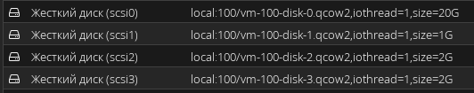
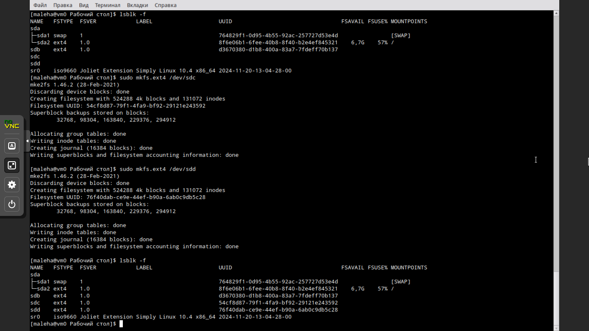
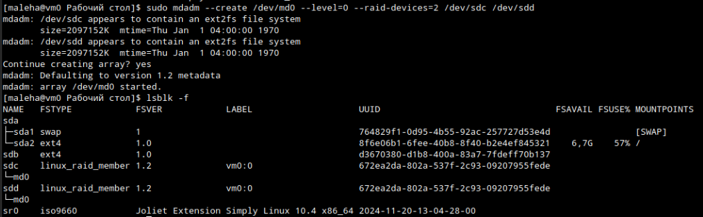
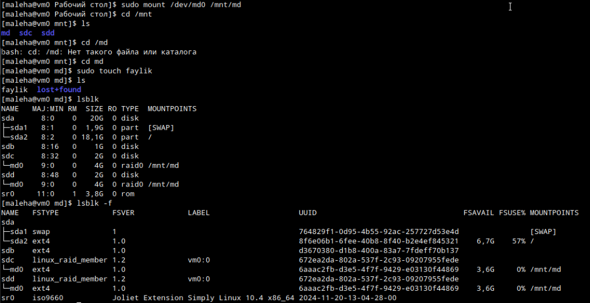
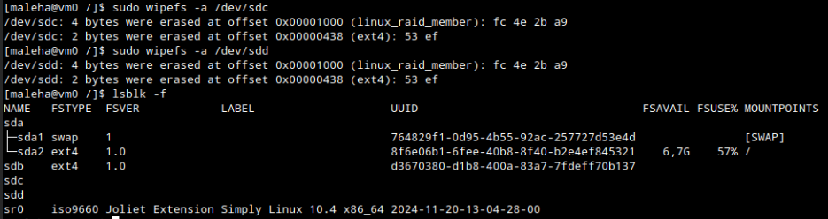
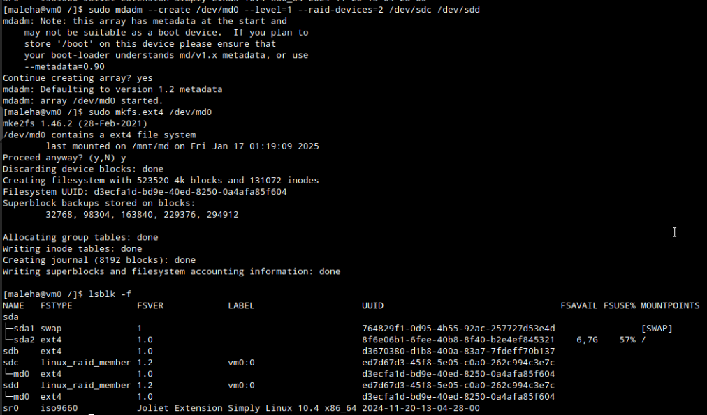

# Продолжаем
## 1 Raid массивы, что такое и какие бывают
RAID (англ. Redundant Array of Independent Disks — избыточный массив независимых (самостоятельных) дисков) — технология виртуализации данных для объединения нескольких физических дисковых устройств в логический модуль для повышения отказоустойчивости и (или) производительности. Бывают 5 стандартых уровней под цифрами 1-5, а также еще 6 современных реализаций: 0, 6, 10, 50, 60, 1E.

RAID 0 (striping — «чередование») — дисковый массив из двух или более жёстких дисков без резервирования. Информация разбивается на блоки данных фиксированной длины и записывается на оба/несколько дисков поочередно, то есть один блок на первый диск, а второй блок на второй диск соответственно.

RAID 1 (mirroring — «зеркалирование») — массив из двух дисков, являющихся полными копиями друг друга.

и т. д....

## 2 Добавьте в виртуальную машину 2 диска, отформатируйте их в ext4




## 3 Создайте из них raid 0 массив
Воспользуемся утилитой `mdadm`:



Также нужно будет опять отформатировать
```bash
sudo mkfs.ext4 /dev/md0
```

## 4 Проверьте всё ли работает
Примонтируем полученный массив к `/mnt/md`. Как видно созданная информация делится и заполняет оба наших диска одновременно.



## 5 Удалите raid0 и создайте raid1
```bash
$ sudo umount /mnt/md
$ sudo mdadm --stop /dev/md0
```





## 6 В чём между ними разница?
В RAID 0 информация разбивается на блоки и записывается на несколько дисков поочередно, что позволяется увеличить скорость считывания в количество-дисков-раз. В свою же очередь RAID 1 просто отзеркаливает данные на все диски. Они становятся полными копиями друг друга, что обеспечивает отличную надежность и сохранность данных.

## 7 Есть ли файловые системы которые поддерживают raid массивы без стороненго ПО
В BTRFS можно создавать массивы любой архитектуры одной командой:
```bash
mkfs.btrfs -L bt_raid -d raid0 -m raid0 -f /dev/sdb /dev/sdc /dev/sdd
```
ZFS поддерживат сборку уровней 0, 1, 5 и 6, а также комбинируемые.

## 8 Можно ли создать raid массив во время установки системы?
Да, при ручной разметке разделов можно.
