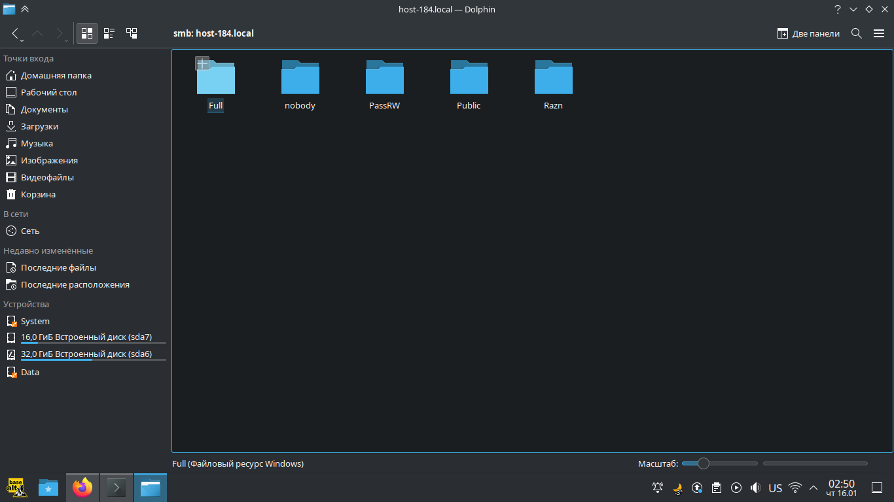

# Шарим

## 1 Установите пакет samba
Установил на локальную машину, подключившись по ssh.
```bash
sudo apt-get install samba
[sudo] password for maleha:
Чтение списков пакетов... Завершено
Построение дерева зависимостей... Завершено
Последняя версия samba уже установлена.
0 будет обновлено, 0 новых установлено, 0 пакетов будет удалено и 0 не будет обновлено.
```
## 2 Что такое общая папка, зачем оно может быть нужно?
Это папка к которой можно иметь доступ по сети с разных устройств. Samba реализует сетевой протокол SMB для этого. Это может понадобится для хранения файлов, которые нужны будут для множества машин в сети, копирования и перемещения файлов от одного устройства к другому. К общей папке может иметь доступ множество разных устройств, Samba поддерживает как Linux так и Windows.
## 3 Создайте общую папку без пароля с правами только на чтение файлов
Создаем папку и задаем права для нее:
```bash
sudo mkdir -p /home/samba/unpass_read
sudo chmod 666 /home/samba/unpass_read
```
Для доступа нужна будет анонимные группа и пользователь:
```bash
sudo groupadd nogroup
sudo usermod -aG nogroup nobody
sudo chown -R nobody:nogroup /home/samba/unpass_read
```
В '/etc/samba/smb.conf' добавил секцию Public, где указал нашу папку, что она только на чтения, а также, что можно подключатся гостям и нужно форсировать анонимного пользователя:
```ini
[global]
        workgroup = SAMBA
        security = user
        passdb backend = tdbsam
        include = /etc/samba/usershares.conf

        server string = Filestore
        map to guest = bad user

[Public]
        path = /home/samba/unpass_read
        guest ok = yes
        browseable = yes
        read only = yes
        create mask = 0666
        directory mask = 0666
        force user = nobody
```
Обязательно перезагружаем 'smb.service' и 'nmb.service':
```bash
sudo systemctl restart smb nmb
```
## 4 Создайте общую папку с паролем с правами на чтение и запись
```bash
sudo mkdir -p /home/samba/pass_rw
sudo chmod 666 /home/samba/pass_rw
```
```bash
sudo useradd -m share -p 123
sudo chown -R share:users /home/samba/pass_rw
sudo chmod -R ugo+rwx /home/samba/pass_rw
sudo apt-get install samba-client
sudo smbpasswd -a share
```
```ini
[PassRW]
        comment = Общая папка с паролем с правами на чтение и запись
        path = /home/samba/pass_rw
        read only = no
        guest ok = no
        browseable = yes
        writable = yes
        create mask = 0666
        directory mask = 0666
        force user = share
        force group = users
```
## 5 Создайте общую папку с доступом для какой-то группы с полными правами
```bash
sudo mkdir /home/samba/full
sudo chmod 666 /home/samba/full
```
```bash
sudo groupadd smb_full
sudo usermod -aG smb_full maleha
sudo chown -R :smb_full /home/samba/full
```
```ini
[Full]
        path = /home/samba/full
        browsable = yes
        writable = yes
        read only = no
        create mask = 0666
        directory mask = 0666
        valid users = @samba_full_access
```
## 6 Создайте общую папку в которой у одной группы будет полный доступ, а у другой только доступ на чтение. Третья группа не должна иметь к ней доступа
```bash
sudo useradd user1
sudo useradd user2
sudo useradd user3
sudo groupadd smb_read
sudo groupadd smb_no_acc_to_that_folder
sudo usermod -aG smb_full user1
sudo usermod -aG smb_read user2
sudo usermod -aG smb_no_acc_to_that_folder user3
```
```bash
sudo mkdir /home/samba/takaya_raznaya
sudo chmod 666 /home/samba/takaya_raznaya
sudo chown -R :smb_full /home/samba/takaya_raznaya
```
```ini
[Razn]
        path = /home/samba/takaya_raznaya
        browsable = yes
        writable = yes
        read only = no
        create mask = 0666
        directory mask = 0666
        valid users = @smb_full @smb_read
        invalid users = @smb_no_acc_to_that_folder
        read list = @smb_read
        force group = @smb_full
```
Естественно в конце перезагружаем 'smb' и 'nmb':
```bash
sudo systemctl restart smb nmb
```
Все папки можно увидеть с помощью файлового менеджера Dolphin:


