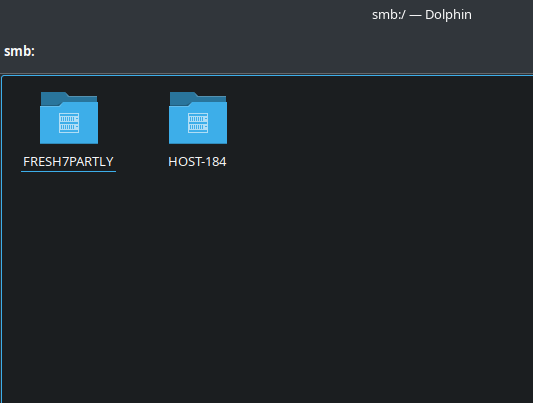
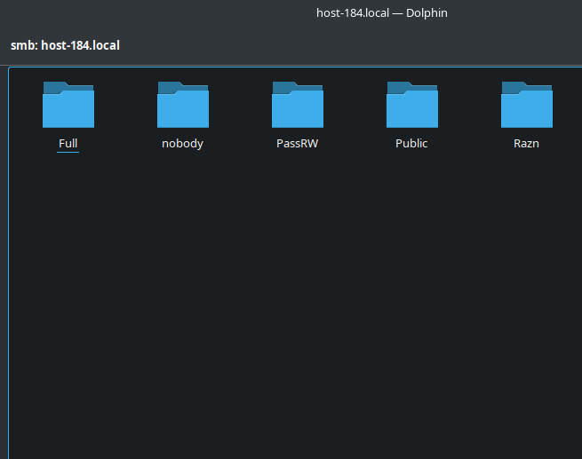

# Открываем firewald

## 1 Удалите iptables и установите firewalld
```bash
$ sudo apt-get remove iptables
Чтение списков пакетов... Завершено
Построение дерева зависимостей... Завершено
Следующие пакеты будут УДАЛЕНЫ:
  NetworkManager-l2tp NetworkManager-strongswan
  alterator-net-iptables etcnet-full iptables iptables-ipv6
  kde5-network-manager-4-nm plasma5-nm-connect-l2tp
  plasma5-nm-connect-strongswan plasma5-nm-maxi strongswan
  strongswan-charon-nm
0 будет обновлено, 0 новых установлено, 12 пакетов будет удалено и 13 не будет обновлено.
Необходимо получить 0B архивов.
После распаковки будет освобождено 7424kB дискового пространства.
Продолжить? [Y/n] y
```
```bash
$ sudo apt-get install firewalld
Чтение списков пакетов... Завершено
Построение дерева зависимостей... Завершено
Следующие дополнительные пакеты будут установлены:
  iptables iptables-ipv6 libnftables1 libnftnl libnm-gir
  python3-module-decorator python3-module-firewall
  python3-module-nftables python3-module-selinux
  python3-module-slip python3-module-slip-dbus
Следующие НОВЫЕ пакеты будут установлены:
  firewalld iptables iptables-ipv6 libnftables1 libnftnl
  libnm-gir python3-module-decorator
  python3-module-firewall python3-module-nftables
  python3-module-selinux python3-module-slip
  python3-module-slip-dbus
0 будет обновлено, 12 новых установлено, 0 пакетов будет удалено и 13 не будет обновлено.
Необходимо получить 1731kB архивов.
После распаковки потребуется дополнительно 9283kB дискового пространства.
Продолжить? [Y/n] y
```

## 2 Попробуйте так-же проверить возможность подключения по ssh
Работает
```bash
$ ssh maleha
Last login: Thu Jan 16 17:29:33 2025 from 192.168.0.153
```
После установки его сервис оказался мертв:
```bash
$ systemctl status firewalld.service
○ firewalld.service - firewalld - dynamic firewall daemon
     Loaded: loaded (/lib/systemd/system/firewalld.service; enabled; vendor preset: enabled)
     Active: inactive (dead)
       Docs: man:firewalld(1)
```
Запустить не получилось, поэтому ребут. Все равно пускает, хотя сервис работает:
```bash
$ ssh maleha
Last login: Thu Jan 16 17:52:47 2025 from 192.168.0.153
$ systemctl status firewalld.service 
● firewalld.service - firewalld - dynamic firewall daemon
     Loaded: loaded (/lib/systemd/system/firewalld.service; enabled; vendor preset: enabl>
     Active: active (running) since Thu 2025-01-16 17:52:39 +04; 2min 2s ago
       Docs: man:firewalld(1)
   Main PID: 6918 (firewalld)
      Tasks: 2 (limit: 4333)
     Memory: 46.3M
        CPU: 757ms
     CGroup: /system.slice/firewalld.service
             └─ 6918 /usr/bin/python3 /usr/sbin/firewalld --nofork --nopid

янв 16 17:52:38 host-184 systemd[1]: Starting firewalld - dynamic firewall daemon...
янв 16 17:52:39 host-184 systemd[1]: Started firewalld - dynamic firewall daemon.
```

## 3 Если её нет то откройте порт
^\n
|

## 4 Выведите список открытых портов с помощью firewall-cmd
Пусто. Скорее всего все порты открыты.
```bash
$ sudo firewall-cmd --list-ports

```
```bash
$ sudo firewall-cmd --list-all
public (active)
  target: default
  icmp-block-inversion: no
  interfaces: enp4s0
  sources:
  services: dhcpv6-client ssh
  ports:
  protocols:
  forward: no
  masquerade: no
  forward-ports:
  source-ports:
  icmp-blocks:
  rich rules:
```

## 5 Можно ли там добавить порты по названию сервиса?
Да. Как раз по этому и работает ssh:
```bash
$ sudo firewall-cmd --query-port=22/tcp
no
$ sudo firewall-cmd --query-service=ssh
[sudo] password for maleha:
yes
```
Для добавления разрешения на доступ, напр., к HTTP, нужно прописать:
```bash
$ sudo firewall-cmd --permanent --zone=public --add-service=http
success
```

## 6 На вашей Локальной виртуальной машине попробуйте подключиться к серверу samba из предыдущих заданий
Сервис Samba не разрешен:
```bash
$ sudo firewall-cmd --query-service=samba
no
```
Саму мою локальную машину Dolphin видит, но при нажатии выбрасывает назад:



## 7 Если не получилось то откройте нужные порты
В [использование портов Samba](https://www.samba.org/~tpot/articles/firewall.html) говорится об портах 137-139 + 445, поэтому лучше открою их все:
```bash
$ sudo firewall-cmd --permanent --zone=public --add-port=137/udp
[sudo] password for maleha:
success
$ sudo firewall-cmd --permanent --zone=public --add-port=138/udp
success
$ sudo firewall-cmd --permanent --zone=public --add-port=139/tcp
success
$ sudo firewall-cmd --permanent --zone=public --add-port=445/tcp
success
```
Обязательно перезагружаем файрвол (также `smb.servise')
```bash
$ sudo firewall-cmd --reload
success
$ sudo firewall-cmd --list-ports
139/tcp 445/tcp 137/udp 138/udp
$ sudo systemctl restart smb nmb
```
Как видно снова есть доступ к моим общим папка на сервере:



## 9 Сделайте так чтобы изменения были постоянными
Как видно я использовал опцию `--permanent`, поэтому изменения применяются к постоянным настройкам файрвола и сохранятся после перезагрузки.
